# Agent Deck

A self-hosted workspace for [Claude Code](https://claude.com/claude-code),
[Codex](https://github.com/openai/codex), Kimi and terminals. Install on Linux (Ubuntu, Debian,
Raspberry Pi), macOS, Windows 11 (WSL2), SteamOS (Steam Machine, Steam Deck) or in Docker, work from a desktop or phone browser, get notified when an agent needs you, and answer
agent questions with one tap or in Telegram.
Sessions live in tmux, keep working after you close the tab, and can be restored
after a reboot.


| Answer with one tap | Screenshots from agents | Sessions & limits |
|:---:|:---:|:---:|
| 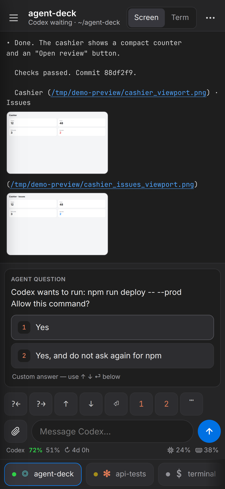 | 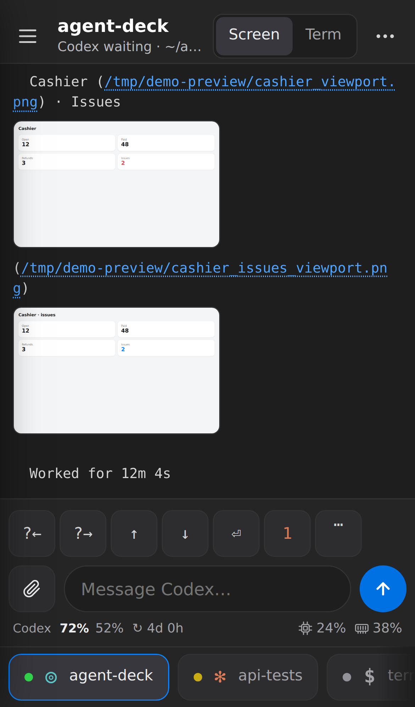 |  |

<sub>Screenshots use demo data.</sub>

## How it works

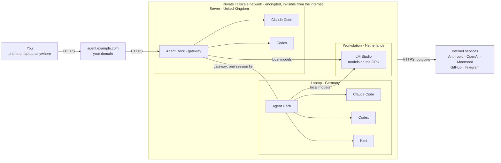

**Tailscale** is a private encrypted network between your own devices: the computers see each other wherever
they are (different countries are fine), and nobody on the internet sees them. Your domain leads to one
computer running Agent Deck as the **gateway**; the other computers run their own Agent Deck and agents and
connect to it inside the network, so all their sessions show in one list. Any computer can serve LM Studio
models to the others.

The agents run on your own computers, in your project folders, exactly as if you had opened a terminal
there. The browser is only a window onto them: close it and the work goes on; open it on a phone and you
see the same sessions. Nothing is exposed to the internet — the phone reaches the computer over
Tailscale. On Linux, when the computer runs out of memory, only the process the kernel kills ends (say, the
agent); its session and tab stay, and the agent can be started again in it.

**Checking results while away from the computer:**

- Agents send screenshots of what they built; the pictures open right in the session output.
- A site an agent starts (a dev server) opens in the phone's browser at the computer's Tailscale address.
- Changes, commits, files and the gallery are in the panel on the right (on a phone it slides in from the right edge); tap a changed
  line to comment on it in your next message.

The **?** next to the search field in the session bar shows the same picture inside the panel.

## Features

- Tabs for all your sessions, grouped by project, with live terminals and "working / waiting / done" status.
- A **+** on each computer and project heading starts a new session there, with the folder already chosen.
- Claude Code, Codex, Claude through Kimi, native Kimi Code or a plain terminal per tab; the **⋯** menu restarts an agent with a new or the same conversation, duplicates a session with a fresh conversation, renames or closes it.
- Pick a GitHub repo and start working; optional git worktree per session (one branch per agent).
- Change history with uncommitted changes: tap a line of the agent's diff to add a `file:line` comment to your message.
- Search the whole output of a session (including scrollback) from the field in the session bar (the search icon on a phone); results drop down under it; quick switcher for sessions and actions with Alt+K, Ctrl+K or ⌘K.
- Project files: browse, edit text, read Markdown rendered, preview images and PDF.
- Drop screenshots and files onto the window (desktop, iPad Split View) to attach them to the open session.
- Claude / Codex subscription limits with a pace forecast; Kimi usage windows and reset times.
- Under the message field: the running agent and model (including after `/model`), remaining quota and today's plan, so limits stay visible on phones.
- Server CPU/RAM indicators beside the message composer.
- Phone friendly (tuned for large iPhones, portrait and landscape): home-screen app, one-tap answers to agent questions, a summary of each conversation and how full its context is, and file attachments up to 200 MB with upload progress.
- One Settings hub: agents, notifications (devices and Telegram), local models, other computers, backups and general preferences, with a getting-started checklist.
- LM Studio profiles: discover known Tailscale nodes or add a custom address, port and API key.
- Local models in Claude Code, with session speed/TTFT measurements and a separate benchmark; no subscription quotas.
- UI in 16 languages, switchable in Settings → Application; extensible file-based locales.
- **Waiting for you:** one list of every agent question and finished session on all connected computers, answerable in place (including custom text answers).
- Notifications on phone and desktop when an agent asks a question or finishes, from every connected computer.
- Screenshots an agent mentions by path (`/tmp/shot.png`, `docs/home.png`) appear as thumbnails under the line and open in a full-screen viewer, also for sessions on connected computers.
- Telegram bot integration: receive agent questions with answer buttons in your private chat.
- One-command installation on Linux (Ubuntu, Debian, 64-bit Raspberry Pi OS), macOS and Windows 11 (WSL2), or a Docker container for NAS and other distributions; autostart and panel updates; in-panel agent setup and login.

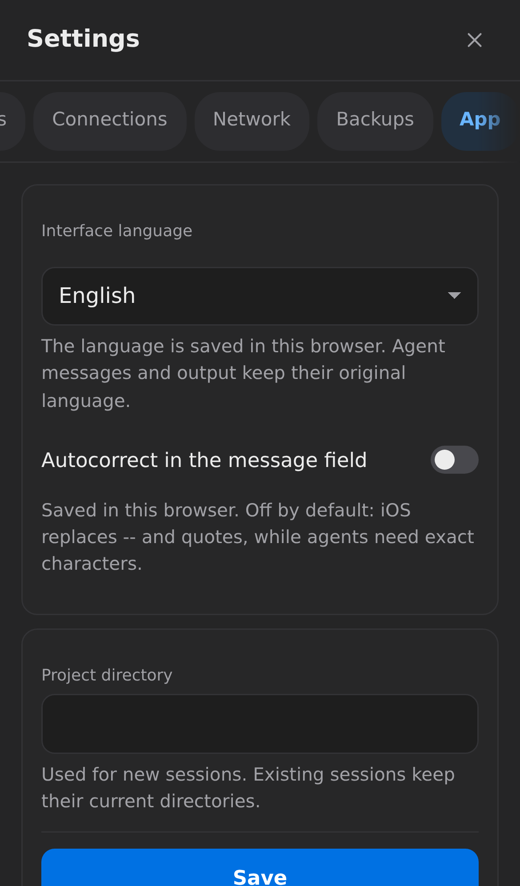

## Install

Pick your platform below. Every grey block is one command: copy it as is.

### Linux server (Ubuntu 22.04 / 24.04, Debian 12+, Raspberry Pi OS 64-bit)

The same installer works on Ubuntu, Debian and a Raspberry Pi 4/5 with the 64-bit Raspberry Pi OS
(32-bit systems are not supported: Claude Code needs 64-bit). Run as root on a fresh server:

```bash
curl -fsSL https://raw.githubusercontent.com/matacoder/agent-deck/main/get.sh | sudo bash
```

The installer prints the panel address, login and password. By default the panel is private:
reachable only from your devices over [Tailscale](https://tailscale.com) (the installer asks you to
log in, or pass `TS_AUTHKEY=tskey-...`).

Russian interface from the first launch:

```bash
curl -fsSL https://raw.githubusercontent.com/matacoder/agent-deck/main/get.sh | sudo PANEL_LANGUAGE=ru bash
```

Your own domain with automatic HTTPS (needed for [phone notifications](#notifications)). Point a DNS
A record (for example `cli.example.com`) to the server first:

```bash
curl -fsSL https://raw.githubusercontent.com/matacoder/agent-deck/main/get.sh | sudo PUBLIC_DOMAIN=cli.example.com bash
```

Certificates are issued and renewed automatically (via Dokploy's Traefik if the server has it,
otherwise via Caddy). This makes a web terminal reachable from the internet, protected by the panel
password.

Other options go before `bash` the same way, for example `sudo MEM_MAX=8G bash`:

| Option | Meaning |
|---|---|
| `MEM_MAX`, `CPU_QUOTA` | Cap memory / CPU for everything the panel runs, e.g. `8G`, `200%` |
| `PANEL_LANGUAGE` | Default interface locale: `en`, `ru`, or another installed catalog; default `en` |
| `DEV_USER` | Name of the (unprivileged) user that runs the sessions, default `dev` |
| `WITH_DOCKER=0`, `WITH_CODEX=0` | Skip rootless Docker / Codex CLI |
| `TS_AUTHKEY` | Join Tailscale without the interactive login |

### macOS (Apple Silicon or Intel)

Run in Terminal **without sudo**:

```bash
curl -fsSL https://raw.githubusercontent.com/matacoder/agent-deck/main/get.sh | bash
```

The installer sets up Homebrew if needed (follow its prompts), Python, tmux, ttyd,
GitHub CLI, Claude Code and Codex, then opens the panel at the Mac’s Tailscale IPv4
address when Tailscale is connected, or `http://127.0.0.1:8790` otherwise. It prints your
panel login and password. Existing installations and agent credentials are reused.
Homebrew may ask to install Apple's command-line tools on a fresh Mac.

Russian interface from the first launch:

```bash
curl -fsSL https://raw.githubusercontent.com/matacoder/agent-deck/main/get.sh | PANEL_LANGUAGE=ru bash
```

Choose the project directory (saved for future reinstalls; also changeable in
**Settings → Application → Project directory**):

```bash
curl -fsSL https://raw.githubusercontent.com/matacoder/agent-deck/main/get.sh | bash -s -- --projects-dir "$HOME/dev"
```

Another port:

```bash
curl -fsSL https://raw.githubusercontent.com/matacoder/agent-deck/main/get.sh | BIND_PORT=8791 bash
```

Keep the panel local-only (no Tailscale access):

```bash
curl -fsSL https://raw.githubusercontent.com/matacoder/agent-deck/main/get.sh | BIND_HOST=127.0.0.1 bash
```

`WITH_CLAUDE=0` or `WITH_CODEX=0` before `bash` skips either agent. For phone access, install
Tailscale, connect it and rerun the installer; it selects the Mac’s Tailscale IPv4 address
automatically. The panel starts when you log in to your Mac, runs as your user and uses a separate
`agent-deck` tmux server, preserving your `.tmux.conf`. A sleeping Mac cannot run agents or serve the
panel. Settings/password: `~/.config/cc-panel/macos.json`; logs: `~/Library/Logs/Agent Deck/`.

Stop autostart without deleting sessions or settings:

```bash
launchctl bootout gui/$(id -u)/com.agent-deck.panel; launchctl bootout gui/$(id -u)/com.agent-deck.ttyd
```

```bash
rm ~/Library/LaunchAgents/com.agent-deck.{panel,ttyd}.plist
```

### Windows 11 (WSL2)

Agent Deck runs inside WSL2 (Ubuntu 24.04) with the regular Linux installer; agents work in Linux.
Requirements: Windows 11 22H2 or newer and virtualization enabled (it is on most PCs). Open
**PowerShell as administrator** (Start → type *PowerShell* → *Run as administrator*) and run:

```powershell
irm https://raw.githubusercontent.com/matacoder/agent-deck/main/install-windows.ps1 | iex
```

The script installs WSL (on a fresh PC it asks you to restart Windows once and run the command
again), installs and signs in to Tailscale, switches WSL to mirrored networking with host loopback, so this PC opens the panel at its Tailscale
address too (other settings in `%UserProfile%\.wslconfig` are kept, the old file is saved as `.wslconfig.agent-deck-backup`), installs
Ubuntu 24.04 and Agent Deck in it, allows the panel port in the firewall for the Tailscale range only,
adds **Agent Deck** to the Start menu and keeps WSL running while you are signed in. The panel login and
password are printed at the end. If WSL settings had to change, WSL restarts once, which stops other
running Linux programs.

Russian interface from the first launch (run both lines in the same window):

```powershell
$env:AGENT_DECK_LANGUAGE = 'ru'
```

```powershell
irm https://raw.githubusercontent.com/matacoder/agent-deck/main/install-windows.ps1 | iex
```

Other options are set the same way before the command: `AGENT_DECK_PORT` (default `8790`),
`AGENT_DECK_DISTRO` (default `Ubuntu-24.04`), `AGENT_DECK_WITH_DOCKER=1` (rootless Docker inside WSL).

Stop autostart (sessions and settings stay in WSL):

```powershell
Unregister-ScheduledTask -TaskName 'Agent Deck' -Confirm:$false; wsl --terminate Ubuntu-24.04
```

Remove the firewall rules:

```powershell
Remove-NetFirewallRule -Name AgentDeck-Tailscale; Remove-NetFirewallHyperVRule -Name AgentDeck-WSL
```

### Docker (NAS, Fedora, Arch, any host with Docker)

One container runs tmux, the terminal and the panel as an unprivileged user; settings, agent logins,
sessions and projects live in the `agent-deck-home` volume. Requires Docker with Compose v2:

```bash
git clone https://github.com/matacoder/agent-deck.git && cd agent-deck && docker compose up -d --build
```

The first start installs Claude Code and Codex into the volume and creates a login password; show it with:

```bash
docker compose exec agent-deck sed -n 's/^PANEL_PASSWORD=//p' /home/dev/.config/cc-panel/env
```

The panel listens on `127.0.0.1:8790` only. To open it from other devices, put the host on
[Tailscale](https://tailscale.com) and run `tailscale serve --bg 8790`, or publish it on your network by
creating `.env` next to `docker-compose.yml` (the panel gives a shell to whoever logs in, so only on a
trusted network):

```bash
printf 'AGENT_DECK_BIND=0.0.0.0\nPANEL_PASSWORD=choose-a-long-password\n' > .env && docker compose up -d
```

To work on projects from the host instead of the volume, uncomment the `/home/dev/dev` mount in
`docker-compose.yml`. Update by pulling the repository and rebuilding — the in-panel update button is off
in a container:

```bash
git pull && docker compose up -d --build
```

To connect this Agent Deck to another one, publish the port on the host's Tailscale address (`AGENT_DECK_BIND=100.x.y.z` in `.env`): connections between Agent Decks use Tailscale addresses only.

### SteamOS (Steam Machine, Steam Deck)

SteamOS erases system packages on every update, so Agent Deck runs as a rootless Podman container
(included in SteamOS 3.5+) with a user service; everything stays in your home folder and survives
updates. No sudo password is needed. In Desktop Mode open Konsole and run:

```bash
git clone https://github.com/matacoder/agent-deck.git ~/agent-deck && ~/agent-deck/install-steamos.sh
```

The script prints the address and password. Useful options (add before the command):
`AGENT_DECK_BIND=0.0.0.0` to reach the panel from your home network, `AGENT_DECK_PROJECTS=~/Projects`
to let agents work in a folder of this machine. Update by pulling and running the script again:

```bash
cd ~/agent-deck && git pull && ./install-steamos.sh
```

The panel starts with your session (also in Gaming Mode). A Steam Deck sleeps when idle and pauses the
agents with it; a Steam Machine is meant to stay on. Agents work inside the container, in its `~/dev` or
the folder you pass, not in SteamOS itself.

### After installing

1. Open the printed address and log in.
2. In **Settings → Agents**, sign in to Claude and/or Codex; connect GitHub in **Settings → Connections**.
3. On a phone, add the panel to the Home Screen (see [Phone](#phone)).

Available interface languages: English, Russian, Spanish, Brazilian Portuguese, German, French,
Simplified/Traditional Chinese, Japanese, Korean, Indonesian, Turkish, Italian, Polish, Ukrainian and
Hindi. [Adding another language](docs/localization.md) only requires a JSON catalog.

**Encryption components.** Backups and notifications use the
[`cryptography`](https://cryptography.io) library. The installer (or the panel itself, later) downloads
the exact wheels pinned in `integrations/dependency_lock.py`, checks each SHA-256 and keeps them in
`~/.local/share/agent-deck/python/`; no pip, virtualenv or root is involved. Without internet access the
panel works normally and retries the download every 10 minutes; only backups and notifications wait.

## Update

The panel shows **↑ vX.Y.Z** in the sidebar when a release is out; click it (or the mobile **⋯** menu)
to update just the panel without root. Settings are kept and running sessions are not interrupted.
See [CHANGELOG.md](CHANGELOG.md).

Full update on Linux, including system setup:

```bash
sudo /opt/agent-deck/update.sh
```

Full update on Windows 11 — rerun the installer in PowerShell as administrator:

```powershell
irm https://raw.githubusercontent.com/matacoder/agent-deck/main/install-windows.ps1 | iex
```

Full update on macOS — rerun the installer:

```bash
curl -fsSL https://raw.githubusercontent.com/matacoder/agent-deck/main/get.sh | bash
```

## Phone

**iPhone / iPad.** Open the panel in Safari, tap **Share → Add to Home Screen**, then always start it
from the icon. It runs full screen, keeps drafts and supports one-tap answers to agent questions.

**Android.** Open the panel in Chrome, tap **⋮ → Add to Home screen** (or **Install app**).

Sessions are in the menu (☰); its badge counts what is waiting for you. Under the session bar a quiet line
says what the conversation is about (its headline and first sentence; tap it for the rest); at the bottom
are the **new conversation** and **restart** buttons, how long the conversation has been running and a short
bar showing how full the context is. Files are uploaded as a raw stream with
progress, so a large video does not have to fit into the phone's browser memory twice.

## Session summary and context

For Claude Code (also on Kimi or LM Studio) and Codex sessions the panel reads the agent's own conversation
file. The bar at the bottom shows how many tokens the latest request carried: green while the conversation
is fresh, orange from 80k (the agent starts losing details), red from 150k (time for a new conversation);
both limits are set in **Settings → General** for this browser;
Codex also shows its context window. The clock before the bar is the time since the first record of the
conversation file: a long conversation has drifted from its start even when compaction keeps it small. The summary under the session bar is written by a model of the same
provider as the session, so the conversation goes nowhere new: Claude Haiku for Claude on the subscription,
Codex's light model for Codex, Kimi for Claude on Kimi, the same local model for LM Studio. It is rewritten
in the background at most every 5 minutes, only while the session is open and only after it changed, and
kept in `~/.cache/agent-deck/summaries/`.

## Waiting for you

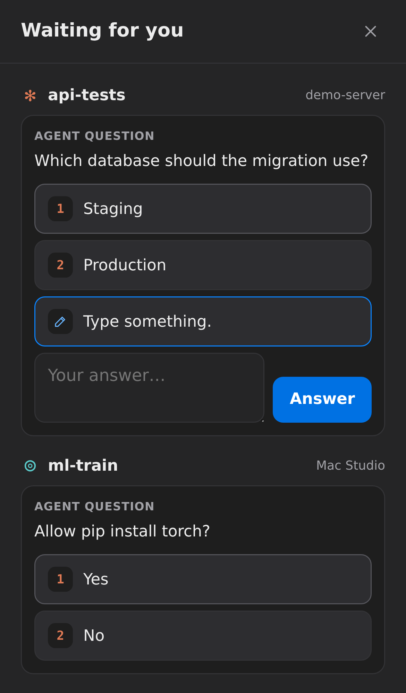

The **Waiting for you** button in the sidebar lists every agent
question and every session that finished work, on all connected computers. Answer a question with one
tap right there; options such as *Other* or *Type something* open a text field and send your own answer.
Tap a session name to open it, on the right computer.

## Project panel: changes, commits, files

Changes, Commits, Feature groups, Files and Gallery share one panel with five tabs. On a wide screen it is
a sidebar on the right: the sidebar button at the right end of the session bar (like the one on the left)
shows and hides it, it stays open while you switch sessions (showing the open session's project) and is
remembered in this browser. Drag the inner edge of either sidebar to change its width (double click for the
default). On a phone it is a drawer like the menu, mirrored: swipe from the right edge or tap the sidebar
button at the top right; swipe it back or tap beside it to close. The phone's session bar keeps only search,
**⋯** and that button. In the drawer the tabs sit at the bottom, under the thumb, and code shows one narrow
line-number column; the code font size is in **Settings → General** (a wide screen also has A−/A+ in the panel). **Changes** shows what is not committed yet, or the last commit when the tree is clean.
With several git worktrees the panel shows the one the agent last named in its output (its path or branch),
marked "auto"; the picker next to the repository name chooses another.

## Project files

The **Files** tab of the project panel browses the session's folder and everything else in your home folder. Text files
up to 1 MB (including `.env`) open in an editor: copy from them, paste a secret in and save, or create a
new file — new files are private (`0600`), existing ones keep their permissions, and a file that changed
on disk after you opened it is never overwritten. The panel's own settings folder (`~/.config/cc-panel`)
is not shown. Any file can be downloaded, up to 40 MB, with the button at the end of its row in the list
(no need to open it) or from the open file. Works for
sessions on connected computers too.

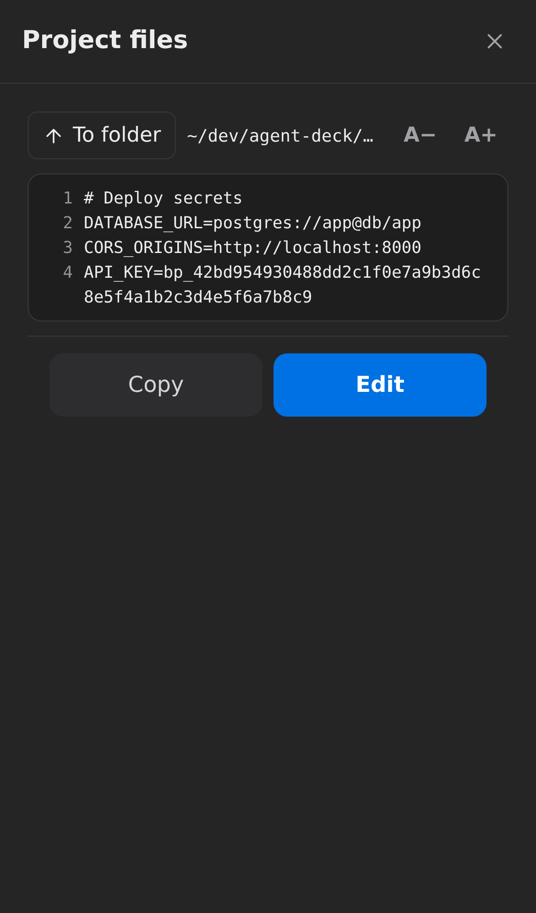

## Change history

The **Commits** tab of the project panel shows the commits of the session's repository: subject, author, time and line
counts; tap one for its full message and a diff per file with line numbers.

The **Feature groups** tab is always ready: the panel sorts new commits into features in the background, a
few at a time, so nothing has to be started or waited for. On top, **Now** shows who works on what: each
author with a commit in the last 7 days and the feature of their latest commit (Denis on the terminal
security, Pasha on the booking card). Commits the model has not sorted yet are listed as plain commits, then
the groups with their summary, authors, commit count and combined diff collected per file.

- Every 5 minutes the panel looks at the repositories of this computer's sessions (all worktrees share one
  history) and quietly fetches them every 15 minutes, so a collaborator's pushed branches show up by themselves.
- A pass starts when the newest new commit is 10 minutes old (an agent committing in a row is sorted once)
  or 20 commits wait; **Sort now** skips the wait. It sends only the existing group titles and up to 40 new
  commits: subject, author and file names, never code.
- Models, tried in this order: Claude Haiku (`claude -p`, no tools) and Codex's light model (`codex exec`,
  read-only sandbox without network) on your subscription, then Kimi with a saved key, then the first
  LM Studio model. Both CLIs run in an empty temporary folder; the answer only places real commits.

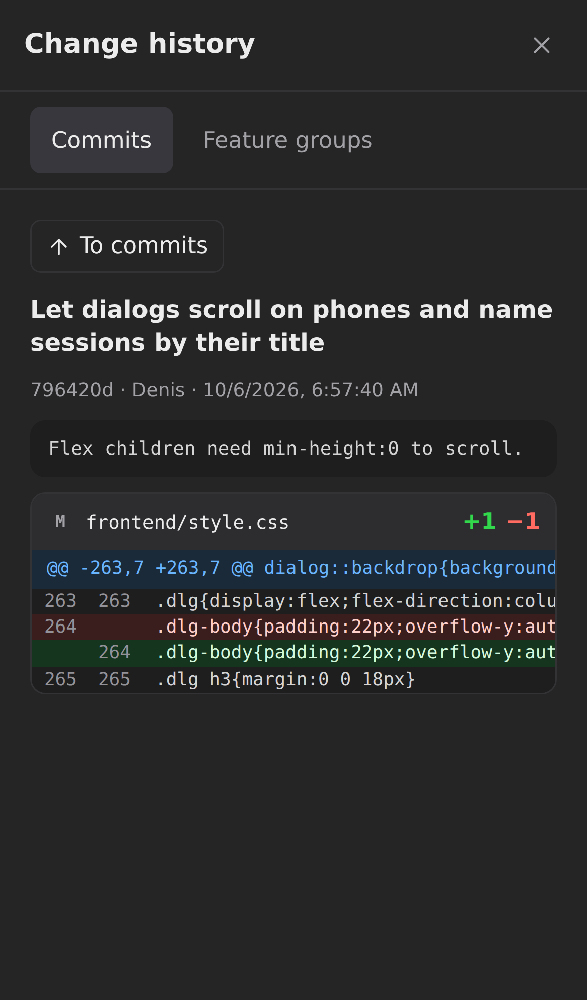 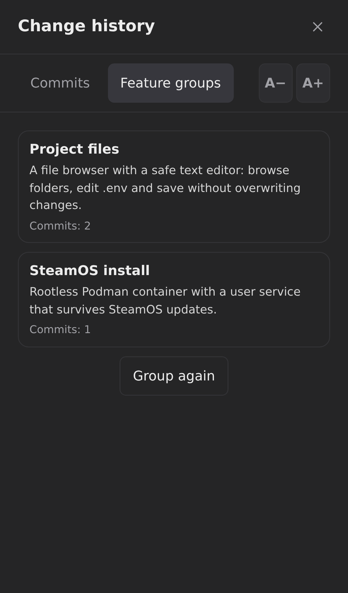

## Screenshots from agents


When an agent prints the path of a PNG, JPEG, WebP or GIF file — absolute, `~/…` or relative to the
session folder, even if the terminal wrapped it across lines — the **Screen** view turns the path into a
link and shows a thumbnail under that line. Tap it for a full-screen viewer: swipe or use ←/→ between
screenshots of the same screen, **Open original** for full size. A file is served only while its path is
visible in that session's recent output, only as a real raster image (never SVG), up to 25 MB.
Thumbnails are scaled down to 480 px with `sips` on macOS or ImageMagick on Linux when available
(cached until the file changes); otherwise the original image is used.

Every picture a session showed is also kept in its **Gallery** (the picture icon in the project panel):
square thumbnails, newest first, opening in the same viewer. The panel copies each picture when it appears
(`~/.cache/agent-deck/gallery`, private), so it stays after the path scrolls away, the agent overwrites
`/tmp/shot.png` with a new one or deletes the file; the Screen view falls back to that copy too. Up to 200
pictures and 300 MB per session, each kept for 30 days.

Paths to other files with a folder in them (`/home/me/trip/plan.pdf`, `src/app.py`) are links too: a tap
downloads the file, with the same rules as Project files (inside your home folder, never the panel's
settings, up to 40 MB).

## Notifications

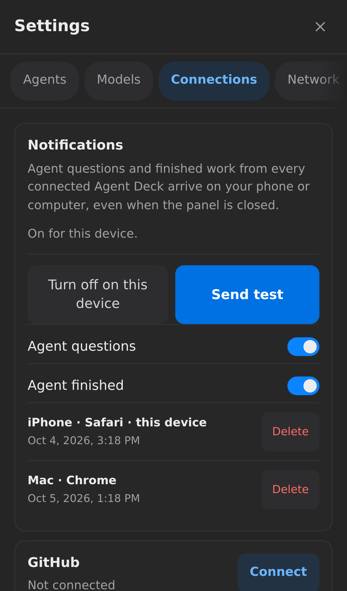

Agent questions and finished work from **every connected Agent Deck** arrive as system notifications
on your phone or computer, even when the panel is closed. Tapping one opens that session, on the right
computer. No account with Apple or Google is needed: the panel signs notifications with its own key and
encrypts them for your device, so the push service only relays ciphertext.

Requirements:

- The panel is opened over **HTTPS** (see the `PUBLIC_DOMAIN` install option). Browsers do not allow
  notifications on plain `http://100.x.y.z:8790` addresses. Only the Agent Deck you open in the browser
  needs HTTPS: it watches the connected computers and sends notifications for all of them.
- **iPhone / iPad:** iOS 16.4 or newer, panel added to the Home Screen and opened from its icon.
- **Android, Mac, Windows, Linux:** a current Chrome, Edge, Firefox or Safari.

Turn on: **Settings → Connections → Notifications → Turn on notifications**, allow the browser prompt.
A test notification arrives right away. Choose the events (agent questions, agent finished) with the
switches; each device can be turned off there or removed from any other device. On iPhone the app icon
also shows the number of sessions that finished.

## Telegram

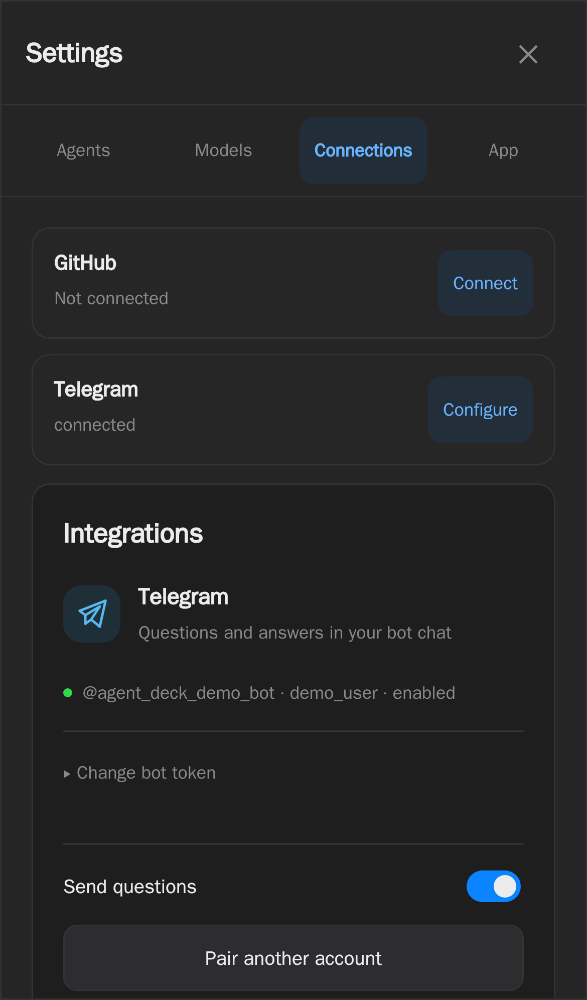

Receive questions from Codex and Claude in your bot's private chat and answer by
tapping a button. Codex questions can arrive while the agent continues working;
the panel opens the queued question, selects your answer and confirms it in the
correct session. Claude through Kimi uses the same Claude adapter; native Kimi uses
recognized active terminal menus. Custom text and multiple selections use the panel.

1. Open **Settings → Connections → Telegram → Configure** on desktop or phone.
2. Paste your existing bot token from [@BotFather](https://t.me/BotFather) and save.
3. Follow **Link my Telegram** and press **Start** in the bot's private chat.
4. Answer a question using its buttons. The bot confirms when the answer reaches the agent. For a
   custom answer (*Other* / *Type something*), reply to the question message with your text.

The pairing link contains a one-time code and expires after ten minutes. The panel
gets the administrator's user/chat IDs from that authorized `/start` message;
an ordinary `/start` does not grant access. Only the paired account can answer.
Pause delivery with the switch or remove the token from the integration card.
Use a dedicated bot without another polling consumer or webhook. No public server
address, webhook endpoint or extra dependency is needed.

**Several computers, one bot.** Telegram delivers button taps to a single receiver,
so configure the bot only on the Agent Deck you open in the browser and connect the
others in **Settings → Network → Other Agent Deck instances**. Their questions arrive
in the same bot, labelled with the computer name, and answers are relayed back through
the authenticated gateway. Leave Telegram off on the connected computers: if the same bot is
still on there, Settings warns and offers **Turn off on <computer>** right in the Telegram card,
whose **⋯** menu also disconnects the bot here.

Settings stay in JSON files. Telegram credentials and pairing are in
`~/.config/cc-panel/integrations/telegram.json`; the durable question outbox is in
`questions.sqlite3` alongside it. Both files are private (`600`), and SQLite needs
no database server. Tokens are never returned to the browser or committed to git.
Answers are protected against stale buttons, repeated clicks and uncertain replays
after a restart. See [integration setup and architecture](docs/integrations.md).

## Backups

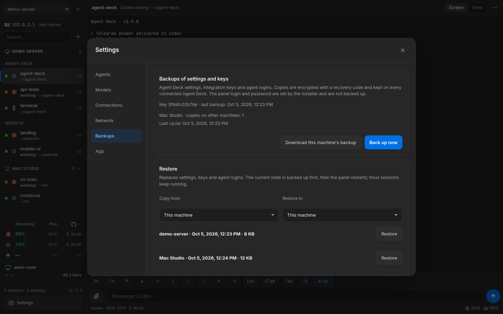

**Settings → Backups** protects Agent Deck settings, integration keys (Telegram, Kimi,
LM Studio, connected Agent Decks) and agent logins (`~/.codex/auth.json`,
`~/.claude/.credentials.json` on Linux, `~/.config/gh/hosts.yml`). The panel login and
password are set by the installer and are not part of a backup. On macOS the Claude login is read
from and restored to the Keychain, so no plaintext copy is written.

1. Click **Turn on backups** and store the recovery code (`AD1-…`) in a password manager.
   It is shown once; without it a backup cannot be decrypted on a new computer.
2. The Agent Deck you open in the browser gives the same key to every connected
   computer, backs up each of them daily (and on **Back up now**) and keeps every copy on
   every other computer. Each computer keeps its last 14 copies per machine.
3. To replace a dead computer, install Agent Deck on the new one, connect it under
   **Settings → Network**, then pick its backup and **Restore to** the new computer. To
   rebuild the main computer, connect any surviving one, choose it as the copy source,
   enter the recovery code and restore. **Download this machine's backup** gives an
   offline `.adbk` file for **Restore from file**.

Backups are encrypted with AES-256-GCM (`cryptography`), so other computers only hold
ciphertext; backups made by 1.5.0 remain restorable. Restoring first backs up the state it replaces, writes files only to their
known locations with `600` permissions and restarts the panel; tmux sessions keep running.

## Security

The panel gives a shell to whoever logs in. On Ubuntu it runs as the dedicated unprivileged
user (with rootless Docker); on macOS it runs as your logged-in Mac user. Keep the password private, and prefer the default Tailscale-only setup unless you need public
access.

## More

Architecture, all options, troubleshooting and development: [docs/DETAILS.md](docs/DETAILS.md).

Backend and browser regression tests: [docs/TESTING.md](docs/TESTING.md).

## License

[MIT](LICENSE)

### LM Studio Connector

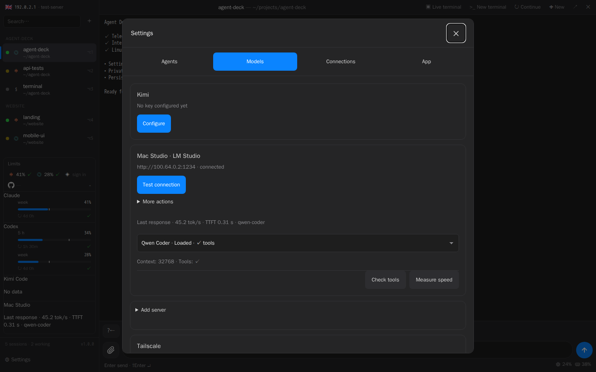

1. Enable the LM Studio server on the machine hosting your model, with its
   Anthropic-compatible `/v1/messages` API reachable over your tailnet.
2. Open **Settings → Models**. Choose **Find servers** to probe known Tailscale
   peers on port 1234, or enter comma-separated custom ports. This checks addresses
   returned by `tailscale status --json`; it does not scan arbitrary networks.
3. Add a discovered server, or use **Add server** with a custom HTTP/HTTPS URL
   and optional API key. Saving checks the connection and lists available models.
4. **Test tools** explicitly verifies a synthetic tool call. **Measure speed**
   runs a small synthetic benchmark; neither test sends an existing conversation.
5. In **New session**, select **Claude** and the local server/model as its source.
   Install Claude Code under **Settings → Agents** if needed.

The selected server and model are pinned to the session, including restarts and
recovery. A missing profile or binding leaves a shell; it never falls back to a
cloud provider. Add a separate profile to change servers while sessions use the
original one. API keys can be rotated without changing the pinned address.

Local models have no subscription quota cards. The panel reports observed
streaming tokens/s and time to first token from real session responses when the
server provides token usage. Native benchmark results are stored separately.
Context length and loaded state come from the model API. Missing GPU, RAM or
other hardware statistics are not estimated. Small context windows and models
without tool support may be unsuitable for coding-agent workloads.

Claude Code started against a local model receives a compact tool set (shell,
files, search, questions and plan mode) instead of roughly 30k tokens of
Anthropic-only tool schemas on every request. Its auto-compact window is the
context length LM Studio reports for the loaded model at launch, or the value
from the last profile check when the server does not answer. Reload the model
with a different context length, then restart the session to apply it.

Profiles and keys live in `~/.config/cc-panel/integrations/lmstudio.json` (0600).
`model-bindings.json` stores private session bindings and `model-relay.json` stores
loopback relay credentials. A local authenticated relay forwards requests to the
pinned server and records timing/usage only; it does not store conversation text.
An in-progress local-model request may need retrying when the panel service updates.

### Multiple Agent Deck instances

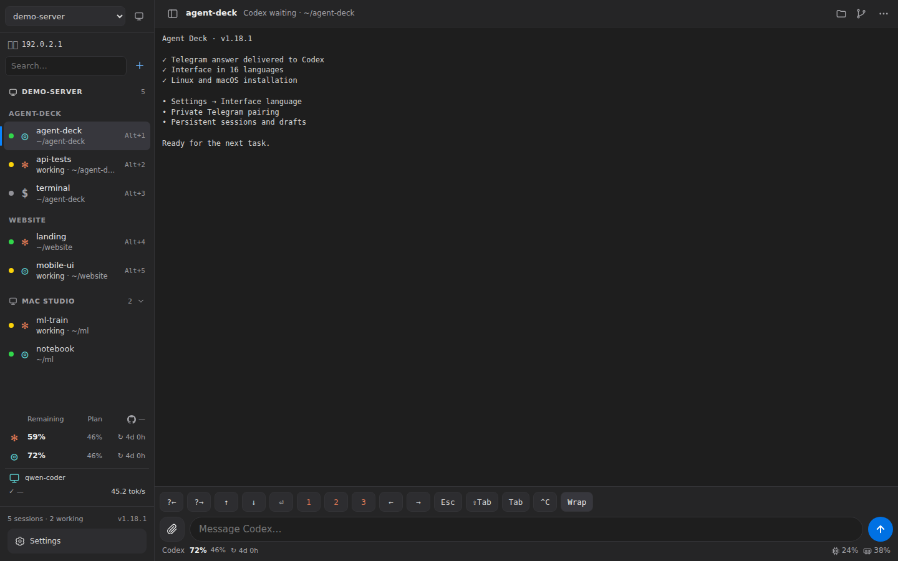

Use **Settings → Network → Other Agent Deck instances** on the server whose
web address you normally open. Click **Discover** to search online Tailscale peers
on port 8790 (or a custom port), or enter a remote `http://100.x.y.z:8790` URL.
Provide that instance's panel login and password, then connect. Select the instance
in the sidebar (the switcher appears once an instance is connected), or tap any of its
sessions: the sidebar lists the sessions of every connected computer under its name, so
switching environments is one tap and happens in place, without reloading the page. Manage its sessions, files, models and live terminal through the
gateway. Your browser does not need direct access to the remote Tailscale address.
The gateway and remote computer must both be connected to the tailnet.

Credentials remain in a private file on the gateway. Existing remote Agent Deck
1.0.7 instances can be connected; only the gateway needs the new UI. Connection
settings always belong to the gateway; session and project settings belong to the
currently selected instance. Switching preserves separate drafts on each machine.

**Update all computers.** The same card shows each computer's version; an arrow marks computers behind
the latest release (also in the sidebar). **Update all** updates every connected computer through the
gateway, then the gateway itself; panels restart one by one and sessions keep running.

**Network and panel address** shows the listening address and browser address and
lets you name the gateway and record its public URL. Recording a URL does not
create DNS records, provision HTTPS or change the reverse proxy. Public hosting
is configured using the installer's `PUBLIC_DOMAIN` and proxy options.

New installs use `~/dev`. Existing explicit project directories are retained;
older default `~/projects` settings pick up `~/dev` when that directory exists.

### Kimi Code

Open **Settings → Models → Kimi → Configure**. Save a Kimi Code API key
and choose a model. Create a session with **Claude Code** and a **Kimi** model source (the Anthropic-compatible endpoint), or choose **Kimi Code** for the native CLI. Install Claude or Kimi
under **Settings → Agents** if needed. An existing `~/.config/cc-kimi/env` key is detected automatically.
Claude through Kimi uses the compact tool set described for local models plus
subagents, web fetch and skills, and compacts at the model's real window (1M for K3).

The key stays on the server in a private file; API responses and tmux commands do not contain it.
Leaving the password field empty preserves the key; **Remove key** removes it from the panel.
The model setting is the default for new native Kimi sessions; existing sessions keep their selected model. Key changes apply on the next agent launch. Native sessions/configuration use
`~/.config/cc-panel/kimi-native/`, preserving the user's independent Kimi configuration.

Kimi quota cards show the account’s returned monthly total/coding and short-period limits,
with reset dates. Monthly windows do not assume a fixed 30-day duration for pace forecasts.

Installed Agent Deck panels automatically check stable releases every 30 minutes.
Disable this in **Settings → App → Automatically update Agent Deck** if desired.
**Check for updates** bypasses the cached release check. Updates preserve tmux
sessions, wait for active local-model requests, and roll back after a failed health check.
Development git checkouts remain excluded. Existing versions need one update to
1.2.0 or later to enable the background updater.
