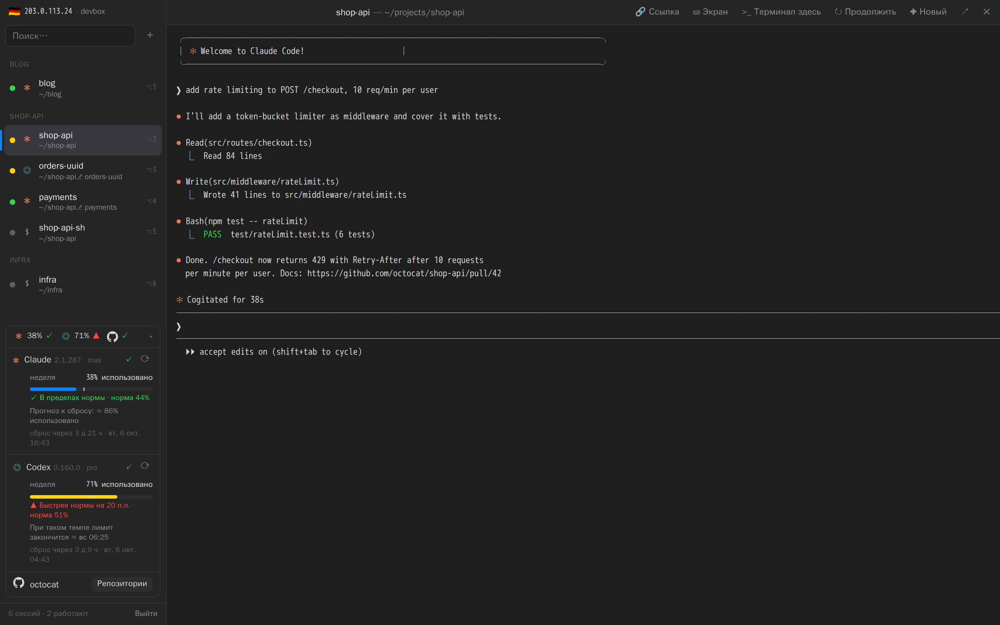
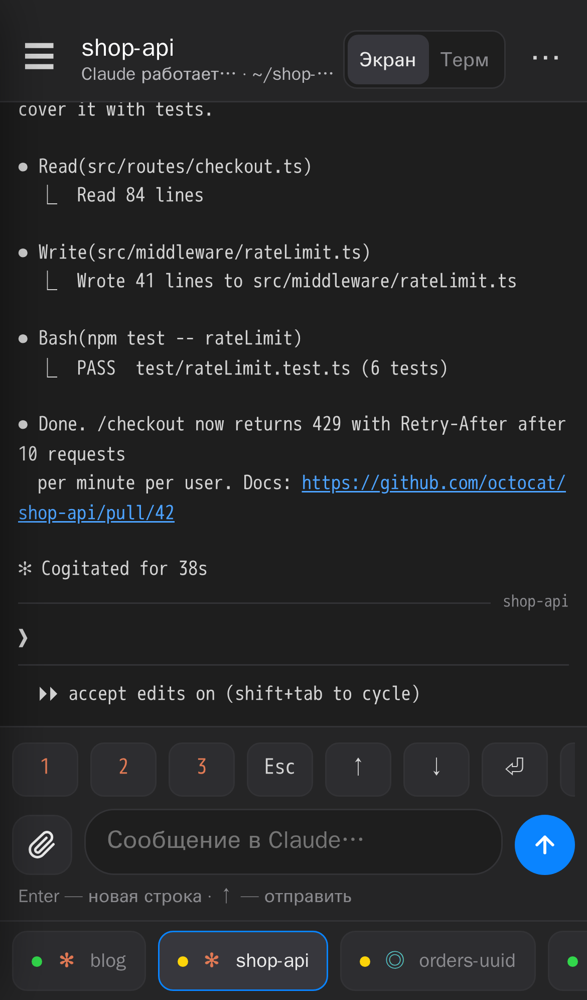
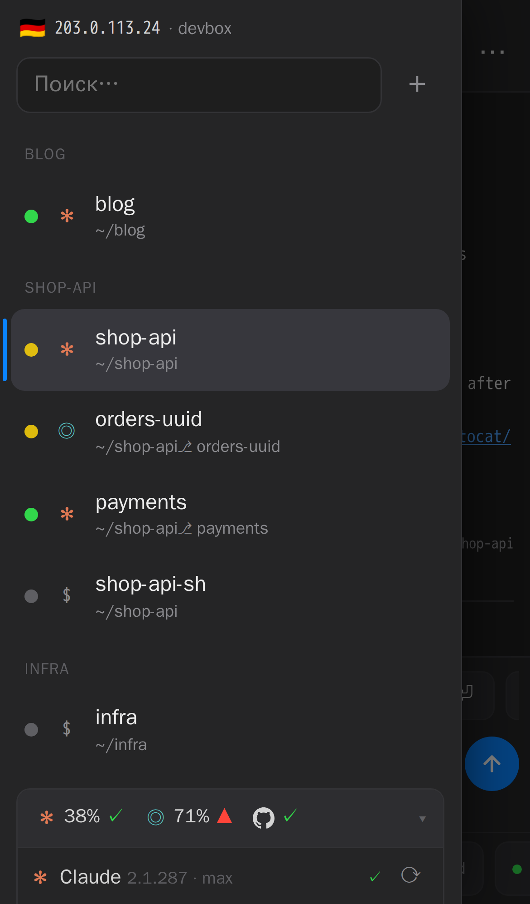
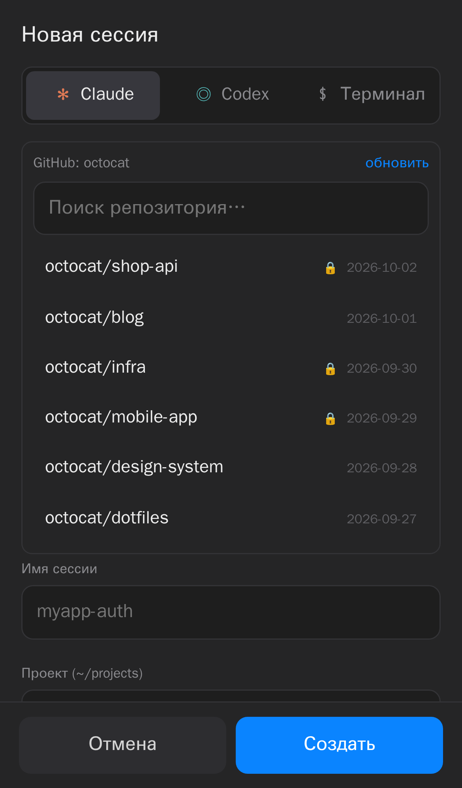

# Agent Deck

A tiny self-hosted "iTerm2 in the browser" for running many [Claude Code](https://claude.com/claude-code)
sessions (and [Codex](https://github.com/openai/codex), or plain terminals) on a remote Linux box: vertical tabs on the left, a live terminal on the right, a phone-friendly
view with a message box, and sessions that survive browser disconnects **and server reboots**.

Everything is reachable only over [Tailscale](https://tailscale.com); nothing listens on a public interface.



| Session screen on a phone | Sessions & limits | New session from a GitHub repo |
|:---:|:---:|:---:|
|  |  |  |

<sub>Screenshots use demo data.</sub>

## Features

- **Tabs for tmux sessions**, grouped by project, with search and status: Claude working (pulsing),
  waiting for you, or not running. A blue dot marks background tabs that just finished.
- **Live terminal** (xterm.js via ttyd) per tab; switching tabs is instant. `⌥1…9`, `⌥↑/↓`, `⌥T`.
- **Session types**: Claude Code, Codex CLI or a plain terminal; "Terminal here" opens a shell in the
  current session's folder.
- **Install / update / log in** to Claude and Codex with one click (their official installers;
  device-code login for Codex).
- **Restart the agent** keeping the conversation (`claude --resume <id>`, `codex resume --last`) or fresh.
- **Persistence**: sessions (folder, conversation id, permission mode) are saved every 5 s and recreated
  with `claude --resume` after a reboot or a tmux crash. A Claude `SessionStart` hook keeps the id
  current across `/clear` and `/resume`.
- **GitHub**: one-click device login (`gh`), repo picker with search, clone into `~/projects`,
  optional **git worktree per session** (many Claudes on one repo, one branch each).
- **Mobile**: installable to the home screen (icon + manifest), session screen with terminal colors, bold/italic/underline, and clickable links,
  message box, screenshot attachments (up to four images, 8 MB each), and keys
  `1 2 3 Esc ↑ ↓ ⏎ ⇧Tab ^C` for answering agent prompts. Uploads stay on the server;
  Codex receives image attachments in its current conversation.
- **Interface updates**: checks for a new UI every 30 s and on return from the background;
  reloads when the screen is idle with no draft or attachments. The mobile action menu
  also has **Обновить интерфейс**, which preserves the current draft and uploaded attachments.
- **Login form** with password-manager support; signed HttpOnly cookie, 90 days.

## Install (clean Ubuntu 22.04 / 24.04)

```bash
gh repo clone matacoder/agent-deck && cd agent-deck     # or git clone
sudo ./install.sh
```

The script is idempotent: run it again after `git pull` to upgrade. It never restarts the tmux
server, so running sessions are not interrupted.

Day-to-day changes to the panel need no root: as the panel user (e.g. from a terminal session in the
panel itself) run `./deploy.sh`. It copies `panel/` to `/opt/cc-panel` (owned by that user), refreshes the
user units / `tmux.conf` / Claude hook and restarts the panel and ttyd; sessions keep running.
Root (`sudo ./install.sh`) is only needed for system-level things: packages, users, Traefik / Caddy.

| Variable      | Default            | Meaning                                                        |
|---------------|--------------------|----------------------------------------------------------------|
| `DEV_USER`    | `dev`              | Unprivileged user that owns tmux, Claude and the panel         |
| `DEV_UID`     | `2600`             | UID for a new user (avoid 999/1000: container processes)       |
| `BIND_HOST`   | Tailscale IPv4     | Address the panel listens on                                   |
| `PANEL_PORT`  | `8790`             |                                                                |
| `TS_AUTHKEY`  | —                  | Join the tailnet non-interactively                             |
| `WITH_DOCKER` | `1`                | Rootless Docker for the user (isolated from any root Docker)   |
| `WITH_CODEX`  | `1`                | Codex CLI via `chatgpt.com/codex/install.sh`                   |
| `MEM_MAX`     | —                  | e.g. `8G`: memory cap for everything the user runs             |
| `CPU_QUOTA`   | —                  | e.g. `200%`: CPU cap (two cores)                               |
| `PUBLIC_DOMAIN` | —                | Also publish at `https://<domain>` (Let's Encrypt)             |
| `PUBLIC_PROXY`  | `auto`           | `traefik` (Dokploy), `caddy` (plain VPS); auto-detected        |

After install:

1. Open `http://<tailscale-ip>:8790`, log in (password is printed once; later:
   `grep PANEL_PASSWORD ~dev/.config/cc-panel/env`).
2. In the sidebar, click **Log in** next to Claude / Codex (once per agent).
3. Click **Connect** next to GitHub.
4. On a phone: Share → *Add to Home Screen*.

## Public HTTPS (optional)

By default the panel is reachable only inside the tailnet. To open it from anywhere with a real
certificate (also enables the browser Clipboard API and a proper home-screen app):

1. Create a DNS **A record** `cli.example.com -> <server public IP>` and wait until it resolves.
2. `sudo PUBLIC_DOMAIN=cli.example.com ./install.sh`

The panel itself keeps listening only on the Tailscale IP; a reverse proxy on the same host terminates
TLS. Which one is picked automatically:

**A. Server with Dokploy (Traefik already owns :80/:443)** — `PUBLIC_PROXY=traefik`.
[`deploy/traefik-dokploy.yml`](deploy/traefik-dokploy.yml) is rendered into
`/etc/dokploy/traefik/dynamic/cc-panel.yml`. Traefik picks it up immediately (watched directory), gets a
Let's Encrypt certificate via HTTP-01 on the first request, stores it in `acme.json` and **renews it
automatically** ~30 days before expiry. HTTP redirects to HTTPS. Traefik's container reaches the panel on
the Tailscale IP through the host.

**B. Dedicated development VPS (nothing on :80/:443)** — `PUBLIC_PROXY=caddy`.
Caddy is installed from its official apt repository (works on Ubuntu 22.04 and 24.04) and
[`deploy/Caddyfile.cc-panel`](deploy/Caddyfile.cc-panel) goes to `/etc/caddy/sites/cc-panel.caddy`
(imported from `/etc/caddy/Caddyfile`; the package's default welcome site is replaced, any other config
is kept). Caddy obtains the certificate on start and **renews it automatically**; HTTP redirects to HTTPS;
websockets need no extra config. If `ufw` is active, 80/443 are opened. The installer refuses to run if
another process already listens on 80/443. Logs: `journalctl -u caddy`.

On a fresh VPS the whole setup is one command:

```bash
gh repo clone matacoder/agent-deck && cd agent-deck
sudo PUBLIC_DOMAIN=cli.example.com TS_AUTHKEY=tskey-... MEM_MAX=12G ./install.sh
```

**Brand-new DNS records:** if the certificate is requested before Let's Encrypt can see the record, the
log shows `acme: error ... NXDOMAIN` and resolvers cache that negative answer for the zone's SOA minimum
(often 5–15 min, `dig SOA <zone>`). Wait that long, then retry. Traefik ignores edits that don't change the parsed config (a comment is
not enough) and doesn't retry on its own; force it without restarting Traefik by removing and re-adding
the file: `mv cc-panel.yml /tmp/ && sleep 3 && mv /tmp/cc-panel.yml .` (in the dynamic dir).
Caddy retries by itself with backoff (or `systemctl reload caddy`). Check:
`docker logs dokploy-traefik 2>&1 | grep <domain>` / `journalctl -u caddy | grep <domain>` and
`echo | openssl s_client -connect <domain>:443 -servername <domain> | openssl x509 -noout -issuer -enddate`.

**Security:** this exposes a web terminal to the internet. Whoever logs in gets the `DEV_USER` shell, its
GitHub token and the Claude / Codex subscriptions. Keep the generated password, consider a Traefik
`ipAllowList` middleware or an SSO forward-auth in front. Behind the proxy the panel takes the client IP
from `X-Forwarded-For` (only from private-network proxies or a proxy on the same host) so the login rate limit stays per client, and
sets the session cookie `Secure` on HTTPS.

## How it works

```
browser ──tailscale──> panel.py (BIND_HOST:8790, login cookie)
                         ├─ /api/*   tmux commands, state, GitHub (gh)
                         └─ /t/*     raw proxy ──> ttyd (unix socket, user-only) ──> tmux attach -t cc-<name>
systemd --user (linger):  cc-tmux  (owns the tmux server: restarts of the panel never kill sessions)
                          cc-ttyd
                          cc-panel (KillMode=process)
```

- tmux sessions are named `cc-<name>`; options `@cc_agent` (claude|codex|shell), `@cc_sid` (Claude
  conversation id) and `@cc_skip` (skip-permissions / bypass-approvals) live on the session.
- State: `~/.config/cc-panel/sessions.json`. If the tmux server PID changes, missing sessions are recreated.
- Files: code in `/opt/cc-panel`, config in `~/.config/cc-panel/`, units in `~/.config/systemd/user/`.

## Security model

- The panel is a **web terminal**: whoever logs in gets a shell as `DEV_USER`. It binds only to the
  Tailscale address; restrict the port further with Tailscale ACLs.
- `DEV_USER` has no sudo and is not in the `docker` group; its Docker is rootless and cannot see
  root containers. Use `MEM_MAX` / `CPU_QUOTA` on shared machines.
- ttyd listens on a unix socket in `/run/user/<uid>` (mode 700), so other local users cannot reach it.
- `gh` login grants access to all your repositories. For tighter scope, log in with a fine-grained
  token instead: `gh auth login --with-token`.

## Useful commands

```bash
sudo -u dev tmux ls                                   # sessions
sudo -u dev tmux attach -t cc-<name>                  # attach over SSH
sudo -u dev XDG_RUNTIME_DIR=/run/user/$(id -u dev) systemctl --user status cc-panel cc-ttyd cc-tmux
sudo journalctl _UID=$(id -u dev) -f                  # logs
python3 panel/make_icons.py                           # re-render icons
```
